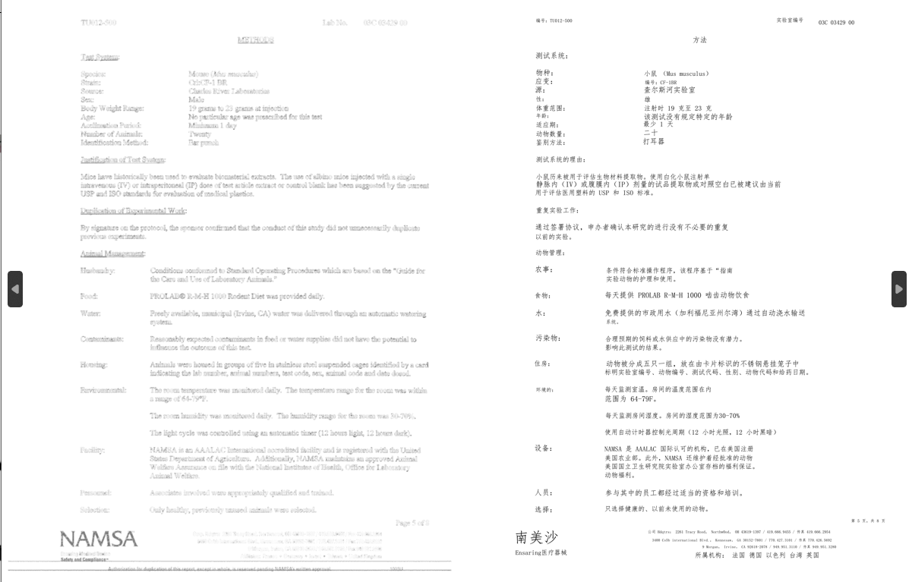
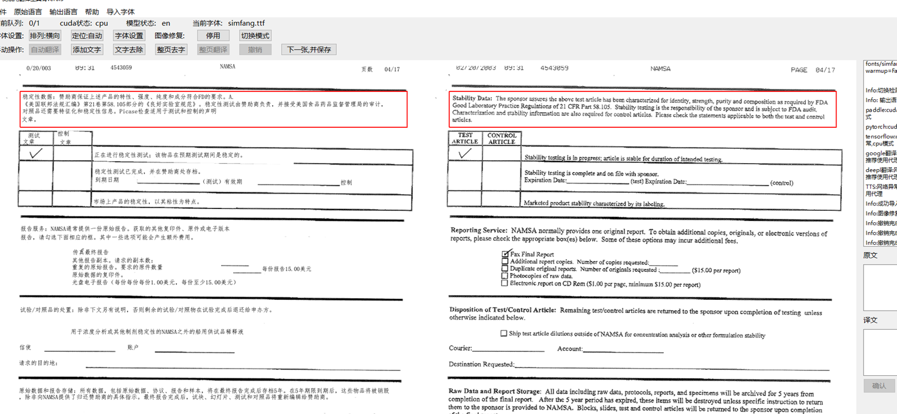
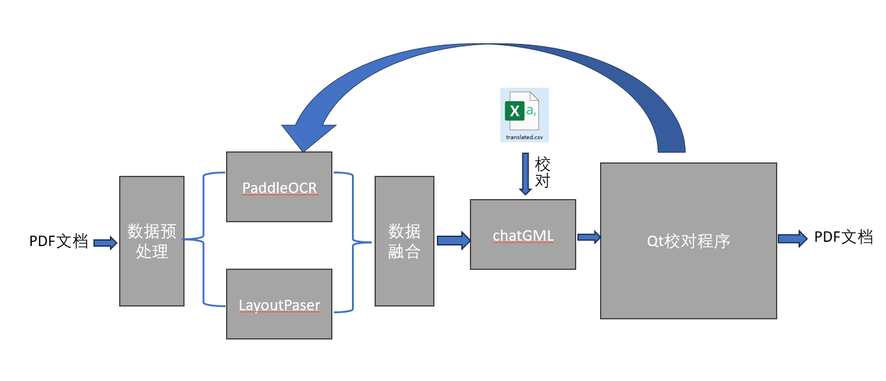
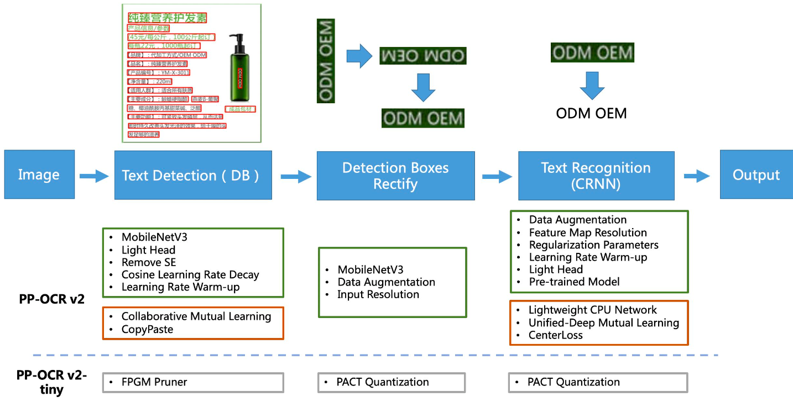
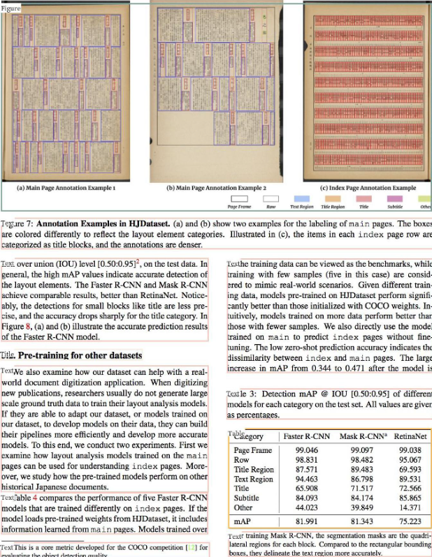
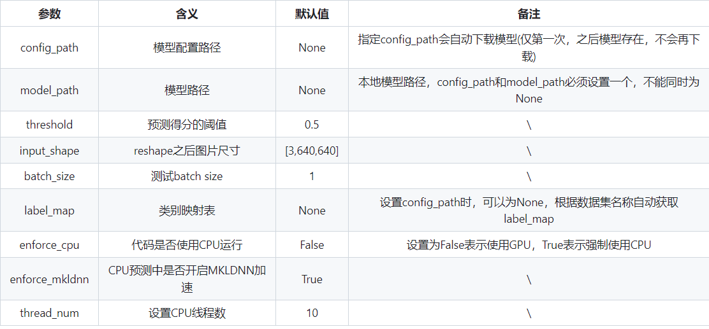
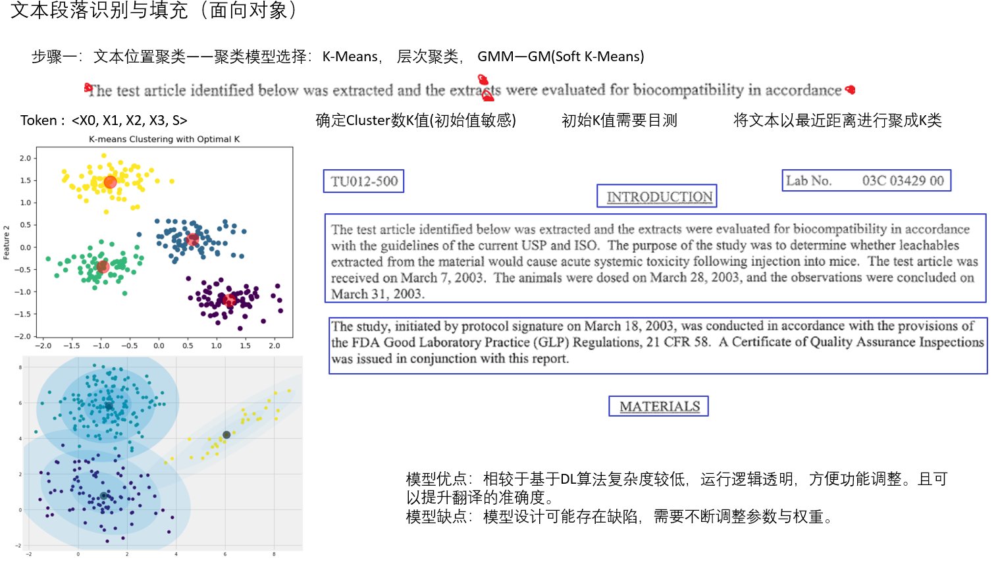
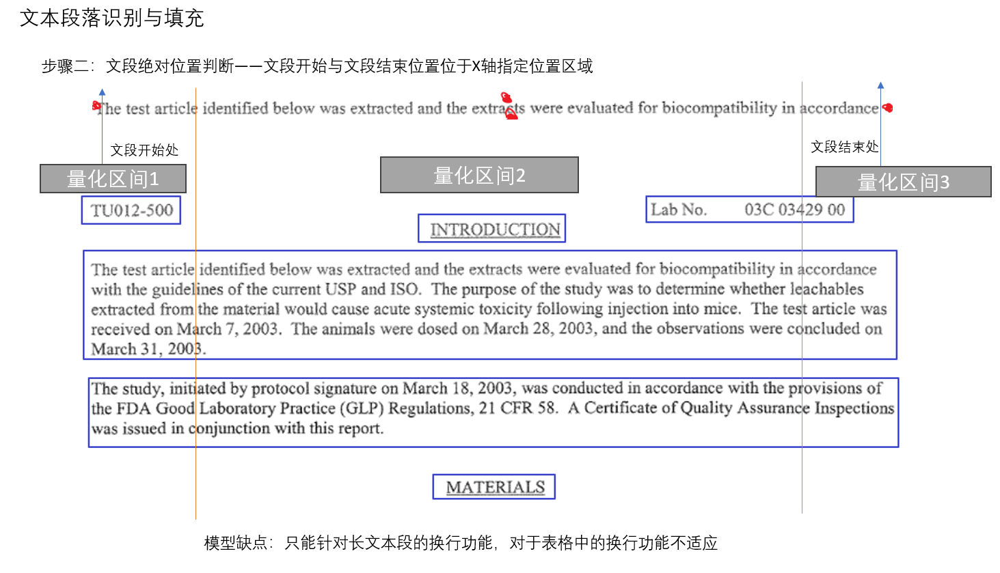
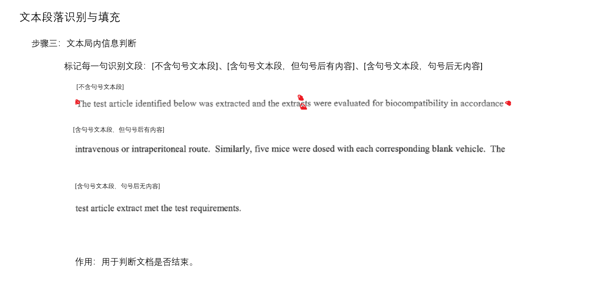

# SSME MP文档翻译程序
  
这是一个基于深度学习的翻译工具
包含OCR识别，PDF拆分，AI图像去字，自动排版，自动嵌字，结合LLM翻译等功能。 
目的是帮助组内翻译人员完成翻译任务更简单，快速的翻译任务。也可以用于加快专业翻译流程。   
效果图如下所示：
> **注意：** 目前Qt程序可能会出现闪退现象。


## 项目需求
项目需求希望将扫描件(.pdf)转换为可编辑的中文文档，以此降低人工校对在翻译流程中的占比，从而提高工作效率。  
> 具体要求如下：
> - 保留原有格式：包括但不限于字体大小不变，文本框、图片、表格等文档信息在原文中的位置相对不变。
> - 准确度：原则上识别结果与原文保持完全一致。
> - 翻译限制：翻译内容要符合上下文逻辑，人名、器械名等专有名词指定翻译。  

### 1. 翻译脚本功能逻辑

1. 输入预处理：程序输入PDF文档后将其风格为待处理图片，并对图片进行二值化、双线性插值缩放、对比度调整等图像增强操作，作为系统输入。
2. OCR：处理后的图片进入PaddleOCR模块进行推理，输出结果为2Dword embedding,即 [ 位置信息， 文字信息， 准确度 ] 等布局信息。
3. 版面识别：与2并行将图像传入LayoutParser模块进行版面识别功能的推理，输出结果为 [ title, table, text, list ] 等布局信息。
4. 数据归类：将2，3步骤获得的数据进行帅选风格，明确需要绘制的字体大小、字体走向、字体位置、字体样式、背景颜色等绘制信息，并对需要翻译的文本经行归类。
5. 翻译模块：将带翻译文本以request报文形式进行百度翻译，并对传回翻译结果结合需求经行词嵌入。
6. 输出处理：将翻译后的图片结果整合成文档(.pdf)，并建立特定目录结果一遍下游任务处理。

### 2. Qt校对程序功能逻辑

1. 输入预处理：每次打开PDF时清理上一次任务缓存，将PDF打开并一同显示源文档方便校对。
2. 字体选择：可以选择嵌字需要的字体样式、字体大小、生成方向等格式选择。
3. 修改文本：可以重新对需要更改的文本内容进行修改与排版。
4. 文字删除：可以对不需要的文本信息进行背景填充。
5. 文本翻译：对鼠标所选框内容进行翻译。
6. 实时保存：每次修改后的文档会实时保存进度，防止程序闪退造成的进度丢失。

### 3. 大语言模型翻译逻辑
1. 翻译限制：本地存储了需要进行翻译限制的CSV文件，以确定不需要翻译的内容(testPics/translated.csv).
2. 大语言模型：本地部署了LLM chatGLM模型伺服，通过request发送需要翻译的报文对文本内容进行翻译。（正在实现）
3. 翻译程序微调：(暂未实现)


### 4. 项目Pipeline
（待作图）



## 主要技术原理以及框架
程序主要使用了基于计算机视觉的光学符号识别技术（OCR）以及版面识别技术（Layout Recognition）构建的工作流。  
使用OCR技术的目的为提取外文文本内容和位置信息；使用版面识别技术是为了获取图片、表格等面向段落的排版信息。  
这两模型的融合使得计算机能够识别、理解文本内容并提供下游翻译工作的精确度。文本的翻译工作则利用本地部署的大语言模型chatGLM经行处理。

### 1. PaddleOCR模型 [链接：PP飞浆PaddleOCR](https://github.com/PaddlePaddle/PaddleOCR/blob/release/2.3/README_ch.md#%E6%96%87%E6%A1%A3%E6%95%99%E7%A8%8B)
PaddleOCR旨在打造一套丰富、领先、且实用的OCR工具库，助力使用者训练出更好的模型，并应用落地。

1. 使用理由：PPOCR为华中科技大学与百度公司联合开发的超轻量OCR系统，主要由DB文本检测、检测框矫正和CRNN文本识别三部分组成。该系统从骨干网络选择和调整、预测头部的设计、数据增强、学习率变换策略、
正则化参数选择，模型pipeline透明易调整，且模型仍在更新和维护。
2. 模型权重：使用模型最新的权重包，通过安装whl下载最新的模型骨架，或者可将骨架保存在本地，本地的骨架路径为（**paddleocr/model**）
3. 模型推理：目前OCR只能识别三种语言（简体中文zh, 英文en, 韩文ko），如果需要出现德文、日文等其它语种，需要更换OCR识别模型。
4. 模型重训练：暂不需要进行重训练。


### 2. LayoutPaeser模型 [链接：Layout Parser](https://layout-parser.github.io/platform/)
LayoutParser是基于Micreosoft的LayoutLM改进后的版面识别模型，该模型的目的是使计算机能够识别文本结构，如自然段文本，标题，表格和列表等内容，
使文档翻译工作中图片、表格、自然段文本的核心模块。

1. 使用理由：LayoutParser是为数不多支持Windows下训练的模型架构，其余的版面识别多是以Facebook公司开发的Detectron架构为基础的模型，该架构只能在
Mac以及Linux下训练及推理，本项目也有基于Linux平台下的Detectron的实现脚本，其优于Windows下的识别效果，详情见(ver3-0test.ipynb)
2. 模型库选择：FUNDS和PubLayNet，repo并未上传数据库，需要开发者自行下载。
3. 模型权重：从数据库下载Windows上的骨架权重
> `model = lp.PaddleDetectionLayoutModel(config_path="lp://PubLayNet/ppyolov2_r50vd_dcn_365e_publaynet/config",
                                threshold=0.5,
                                label_map={0: "Text", 1: "Title", 2: "List", 3:"Table", 4:"Figure"},
                                enforce_cpu=False,
                                enable_mkldnn=True)`  
>   
4. 模型推理：目前只是用了text以及table两基于段的分类，如需要提高下游LLM的翻译精准度可增加figure、title或重新训练模型。
5. 模型训练：目前模型训练的数据集来源于科技论文PudLayNet和噪声扫描文档FUNDS，可通过SSME的技术文档作为database对模型权重
经行重训练没从而提高该模型的识别准确性。


### 3. 文档格式校对
该模块是对数据merge以及Analyze的逻辑模块，主要负责对上述两模型经行数据融合。其中关键部分是对LayoutParser识别不准的内容经行重新
校对并重新绘制段落，校对算法使用基于集合的聚类方法，提取文本几何特征，对自然段经行重分类，结果是很大程度上缓解了LayoutParser对复杂
长文本识别问题，其中部分判断规则如下：





## 开发者内容
### 1. 安装
开发者直接git  
注意paddle，pytorch，tensorflow2（暂可不用） 需要官网下载，任意版本。    
注意30系显卡不支持cuda10.2。
模型checkpoint需要联网下载最新版本，或者使用本地上传保存的版本。  
为了更好的显示错误原因，整合包保留了控制台（2024.06.28控制台已disable）。  
目前翻译功能使用Baidu翻译的API进行翻译，限制为100,000/tokens_per_month，注意使用限制。

```diff
! 第一次运行程序需要联网下载model权重。
! 请在确认PaddleOCR和LayoutParser正常运作后使用。
! 尽量维持原先目录结构，数据统一存放在'/testPics/'下。
```  

### 2. 更新
【2024.07.09】更新了说明文档  
【2024.07.08】增加了基于Detectron的表格识别模块，使得程序可以识别表格，并且提高了识别自然段的识别精度。测试代码保存为ver3.0Test,
如果要使用ver3.0Test.ipython需要在Linux环境下运行。
【2024.07.02】解决了部分闪退问题；优化了工作流，可以实时保存任务进度  


### 3. 使用方法
1.先运行ver2.0.py脚本，脚本输入为需要翻译的PDF文档的绝对路径，输出结果为PDF保存在/OCRtranslated/  
2.打开main.py  
3.导入/OCRtranslated/文件下的翻译过 
4.设置要翻译的语言（暂时只支持En）  
5.手动选择区域，选择需要的功能  
6.手动修改译文，点击确定  
7.单张翻译完后点击下一张，翻译结果会自动以PDF形式保存在/out/下
  
扫描图片不清晰，图片太小,准确度会下降
使用相同颜色阴影可以加粗字体，需要的字体可以自己导入，支持.ttf格式字体  
如果发生闪退等意外缓存的图片已经保存，只需要再次打开即可  

根据电脑配置运行速度不同，可能会出现卡顿，目前使用的是CPU版本  
  
报错处理:  
短时间卡顿是正常现象  
翻译时请检测与Baidu_translaion网络连接
请联系相关技术人员  
  
环境要求:  
暂时需要网络,使用Baidu翻译(中国)  
提示：ssr可能造成网络异常，请自行尝试  
有显卡可显著加快图像处理速度(CUDA)  
cpu会非常慢  
需要驱动版本>=472.50  
整合包自带CUDA与cudnn不需要额外安装

### 4. 后续更新方向
1. 可以尝试在Windows上部署Docker来实现Linux系统以实现基于Detectron的版面识别模型，以提高自然段、表格和图片识别的准确性。
2. 以伺服器形式部署chatGML并做数据分流，使得LLM可通过报文访问并服务于不同用户的不同任务。
3. 使用SSME内部翻译后的文档构建database重新对于大语言模型经行微调，尝试LoRA微调方法以减少数据集的收集。
4. 在QT校对程序中添加”文本居中嵌入“功能。

